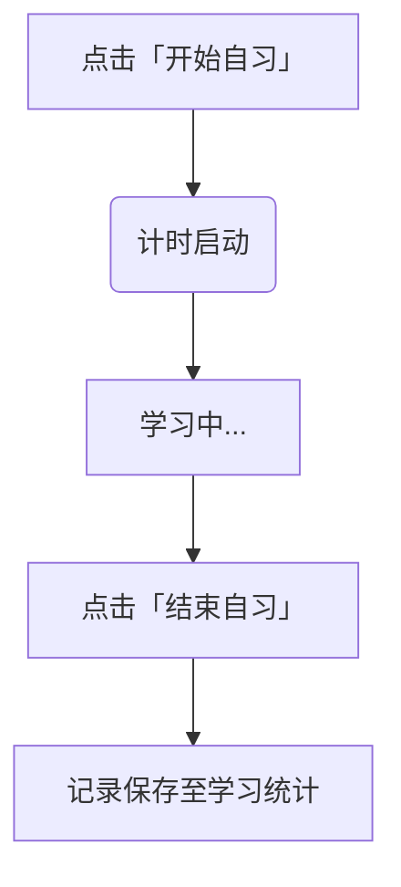

北大学习时空管家 📚⏰

你的专属北大学习管理神器

北大学习时空管家是一款专为北大学子打造的一体化学习管理软件，整合课表管理、空教室查询、自习时间记录及日程提醒功能，助你高效规划校园学习生活！

注意：*****本软件可能不适配深色主题*****

🌟 核心功能

| 功能模块&#xA;          | 功能详情&#xA;                                                 | 实用场景举例&#xA;                |
| ------------------ | --------------------------------------------------------- | -------------------------- |
| **智能课表管理** 📅&#xA; | 支持从树洞扒取课表 HTML 文件，拖拽导入即可生成可视化课表；点击无课时段，智能推荐空闲教室&#xA;      | 快速整理学期课表，临时寻找自习教室&#xA;     |
| **自习时间记录** ⏳&#xA;  | 一键开启 / 结束自习计时，多维度统计学习时长；支持秒、分钟、小时单位切换；可删除历史记录&#xA;        | 量化每日学习投入，复盘学习效率&#xA;       |
| **日程提醒系统** ⏰&#xA;  | 日历式日程管理，任务按紧急程度智能标色（1-7 天红 / 8-14 天黄 /≥15 天绿）; | 避免错过作业 DDL、考试、会议等重要事项&#xA; |

🚀 快速上手指南

### 1. 课表导入与空教室查询&#xA;

*   **步骤 1**：从树洞下载课表 HTML 文件(txt或者html都可以) q&a:为什么不用excel课表？   北大的excel课表太难找了

*   **步骤 2**：将文件拖拽至「我的课表」界面，自动生成可视化课表

*   **步骤 3**：点击课表中的空白时段，选择目标教学楼，查看实时空闲教室

### 2. 自习时间记录&#xA;

### 3. 日程提醒设置&#xA;

1.  在主界面日历中点击目标日期

2.  输入日程内容

3.  日程自动按紧急程度标色，并在到期前提醒

📊 学习统计可视化

*   **时间维度**：按日、周、月统计学习时长

*   **图表类型**：支持条形图、折线图切换

🛠️ 项目团队

| 角色&#xA;  | 姓名&#xA; |
| -------- | -------- |
| **项目策划** | 汤伟杰&#xA; 
| **项目策划** | 李凖珩&#xA; 

